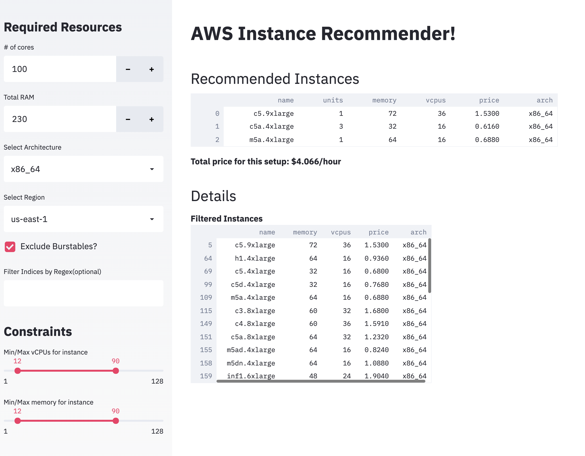

# instance-recommender

### Getting started
* Clone the repository
```
git clone https://github.com/alexsanjoseph/instance-recommender
```
* Optionally create a new virtualenv
```
python3 -m virtualenv .env
source .env/bin/activate 
```
* Install dependencies
```
pip install -r requirements.txt
```
### UI

Run streamlit UI using
```
 streamlit run streamlit.py
```




### Refresh instance list
```
python utils/refresh_instance_list.py
```